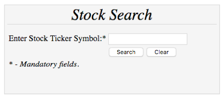
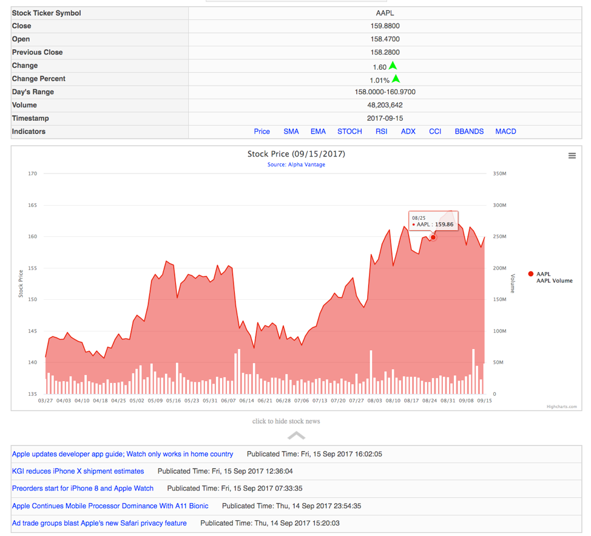
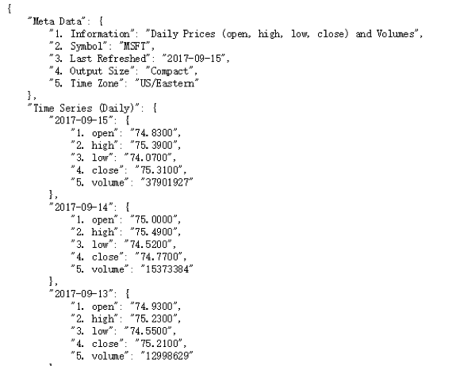
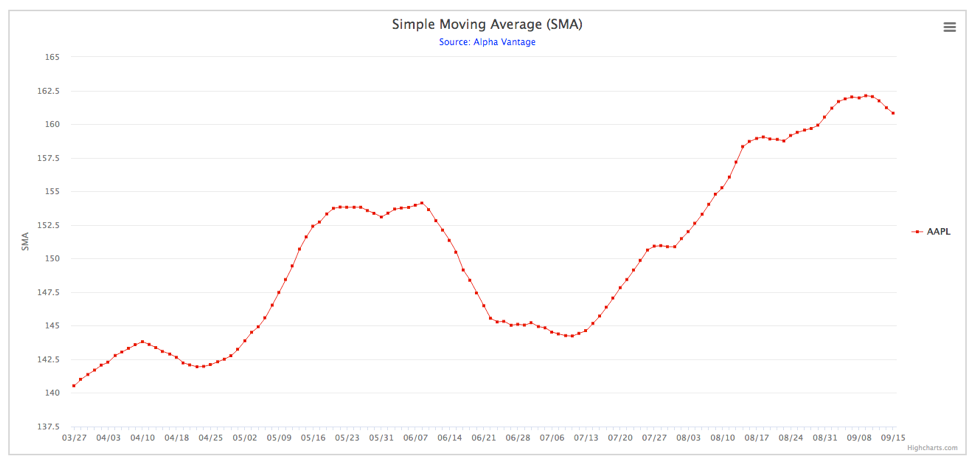
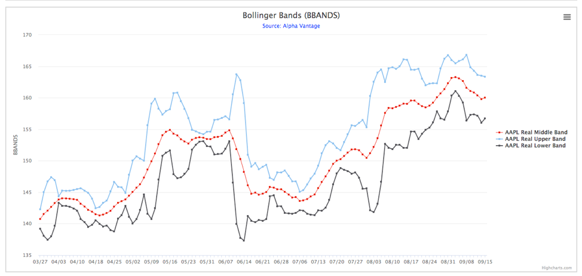
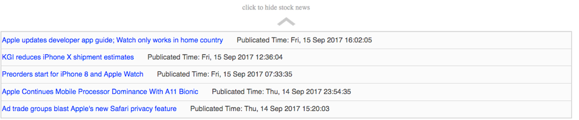
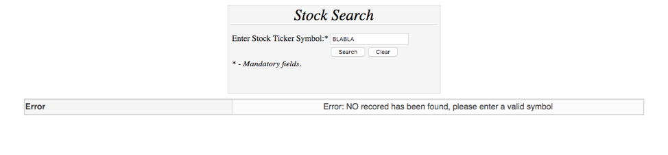

# Stock-Search-Website

This webpage was made as part of course CSCI 571 (Web Technologies) in Fall 2017 at USC

Description:
Created a webpage that would allow you to search for stock information using the Stock quote API. The results will be displayed in both tabular format and charts format using HighCharts. There will be News clips as well for the selected stock.
I set up an Apache + NGINX server and made Apache handle the static load and NGINX handle the dynamic load

1. User first opens a page where he/she can enter a stock ticker symbol (example: GOOG, FB, AAPL, MSFT etc) 

2. Once the user has provided valid data, the script sends a request and retrieves the form data, reformats it and sends it to the Alpha Vantage RESTful web service.

3. There are basically three components displayed vertically from top to bottom of the web page:
stock information table, stock price/volume/indicator chart and stock news. 

4. Alpha Vantage APIs has two kinds of web services: Daily Time Series Data and Technical Indicators. The Daily Time Series Data web service returns a JSON file which contains the historical stock quote of the company, and Technical Indicators  returns a JSON file which contains the indicator specific data.

> Example Technical Indicator : https://www.alphavantage.co/query?
function=SMA&symbol=MSFT&interval=weekly&time_period=10&series_type=open&apikey=demo

> Example Daily Time Series Data : https://www.alphavantage.co/query?function=TIME_SERIES_DAILY&symbol=MSFT&apikey=demo 

5. Time Series Data is displayed in the form of charts using HighCharts. Initially, the chart shows the historical stock
price (in red) and volume (in white bar) for the last 6 months by an interval of one day.
Inidcators are also displayed in the form of charts. Some indicators have multiple fields. The chart handles this case and shows all the fields in different color.

6. The PHP script also uses the input information (Stock Ticker Symbol) to request a XML file containing stock news about the searched company. All the stock news comes from the Seeking Alpha News RSS feed. The URL to request the news is:
https://seekingalpha.com/api/sa/combined/SYMBOL.xml. The response is an XML-formatted object, from which necassary information is extracted and top 5 news articles are displayed in tabular format. The titles hyperlink to the corresponding news

7. Incase incorrect stock tickr symbol is entered by the user, following error message is displayed:

